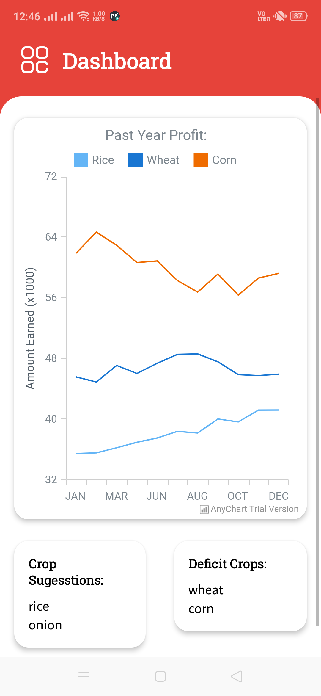
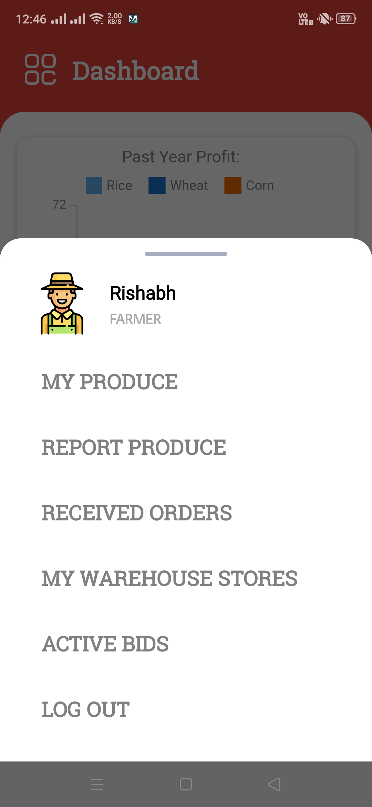
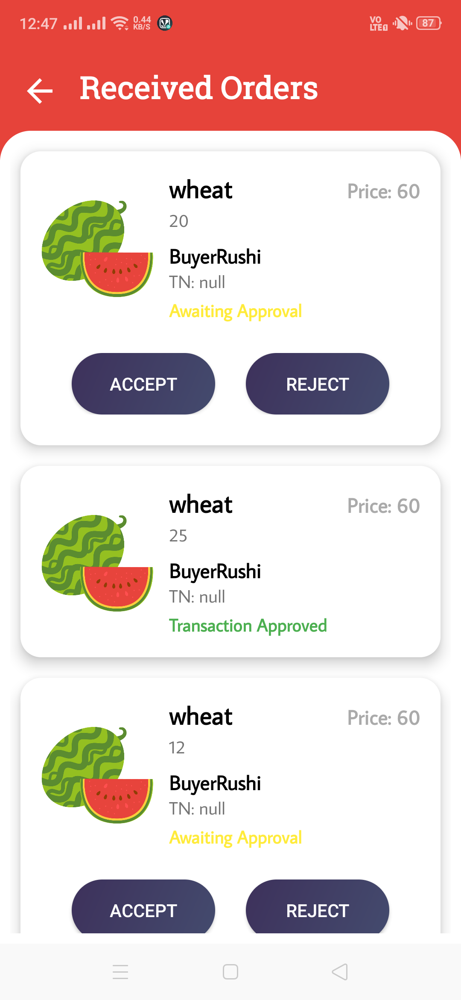
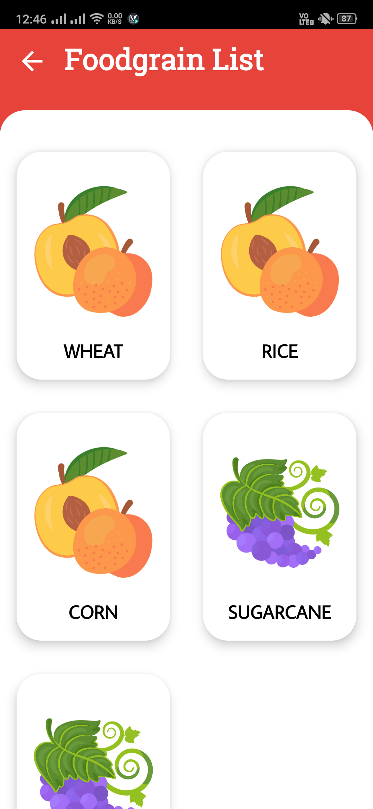
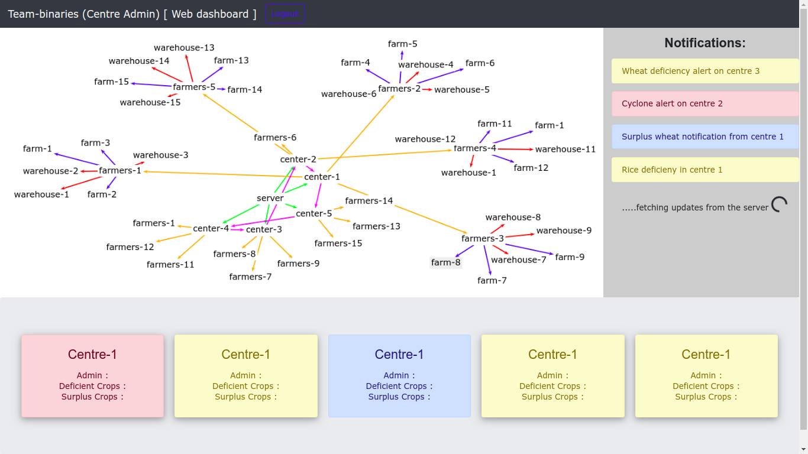

# Team CATVIDEOS aka [ Team binaries ] go! - Codeutsava 4.0 [ NITRR ]

## The problem Kisan Mitra solves
1. Connects farmers directly to the buyers.
1. Place for a farmer to easily sell their produce.
1. An easy and efficient way for farmers to find warehouse and delivery services.
1. A Farmer can sell a large quantity of produce instantaneously.
1. Biding System - Large buyers like restaurants can get a fair deal with the removal of intermediaries.
1. Efficient management of local area production.
1. Waste management and food disparity removal.
1. The entire product is seamlessly integrated with the SMS service.

## Team CATVIDEOS:

1. Rushikesh Pupale
1. Naveen Sundar
1. Rishab
1. Adarsh Shrivastav
1. Abilasha 
1. Sonal Suman

## Screenshots of app:

    
    
    
    

## Screenshots of web dashboard:

